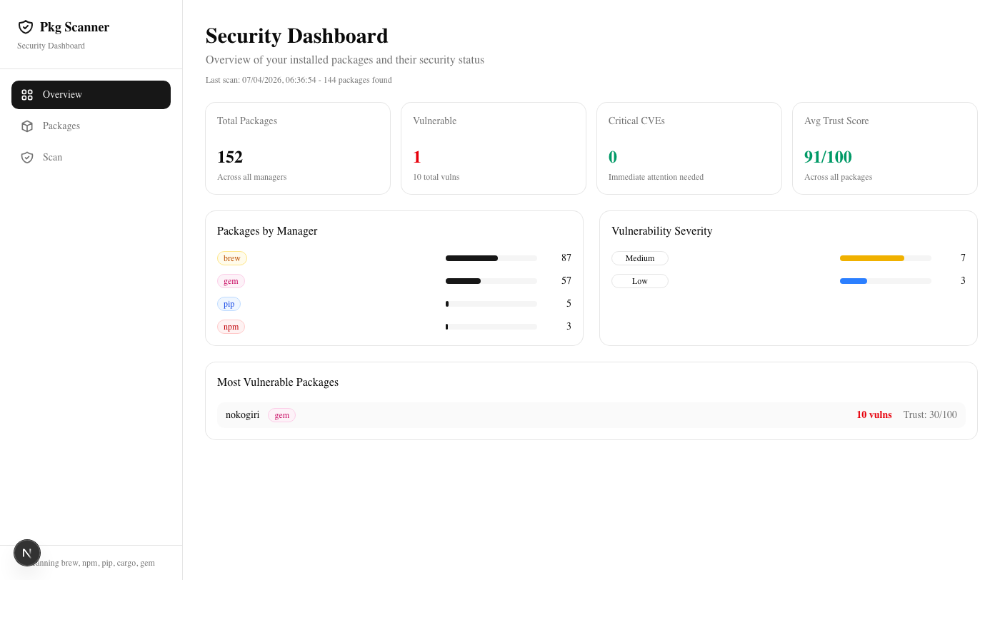
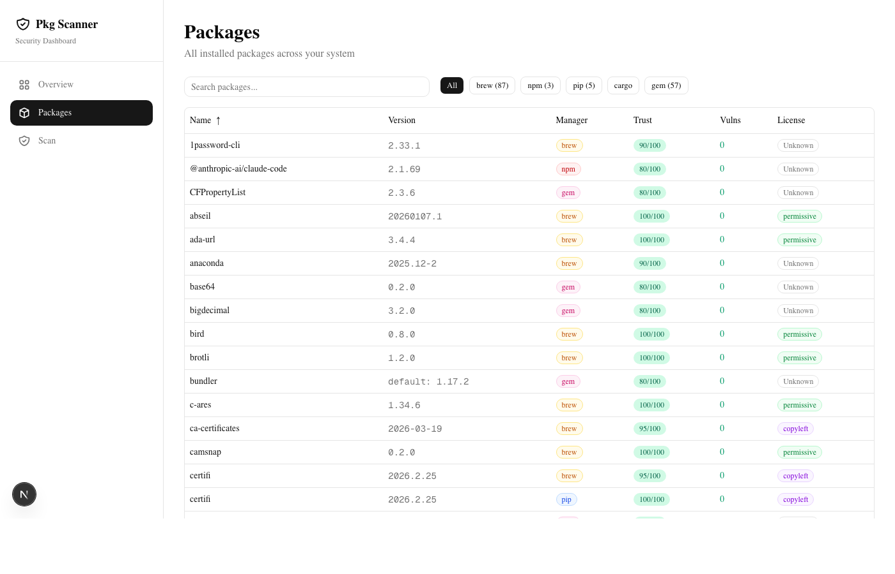
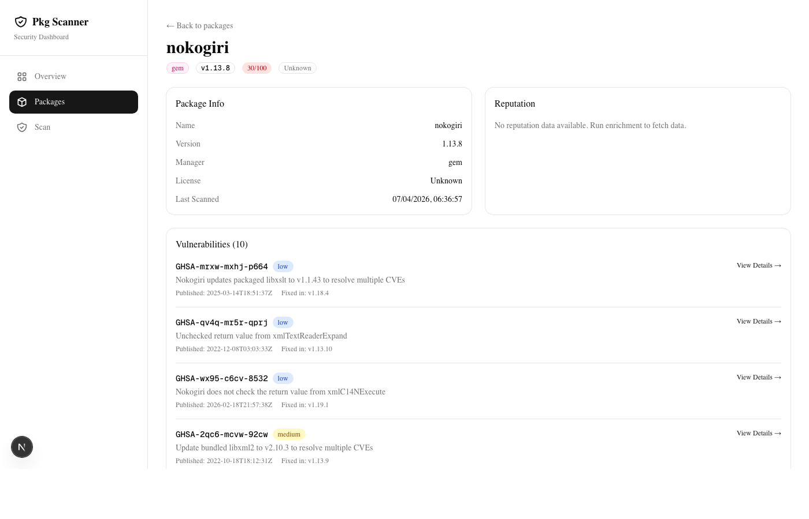
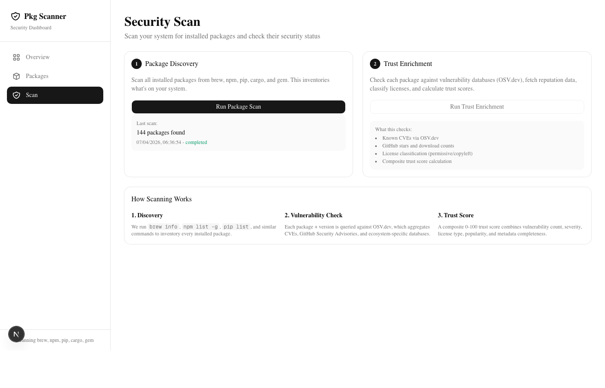

# pkg-scanner

**Security scanning dashboard for every package on your machine.**

Scans all installed packages across Homebrew, npm, pip, Cargo, and RubyGems — then checks each one for known vulnerabilities, license compliance, and source reputation. All results are displayed in a local web dashboard with trust scores.

[](LICENSE)
[](https://nodejs.org/)
[]()

### Dashboard Overview


### Package Inventory with Trust Scores


### Vulnerability Deep Dive (nokogiri — 10 CVEs)


### Scan Controls


---

## The Problem: Your Machine is a Supply Chain

Every developer's machine is an accumulation of trust decisions they never consciously made.

When you run `brew install`, `npm install -g`, or `pip install`, you're trusting that package — its maintainers, its dependencies, its build pipeline — with access to your system. Over months and years, hundreds of packages accumulate. Some were installed for a project you abandoned. Some were pulled in as dependencies of dependencies. Some haven't been updated since they were first installed.

**Nobody audits what's already installed.**

Security scanning tools focus on project dependencies (`package.json`, `requirements.txt`, `Gemfile`). But what about the packages installed *globally* on your machine? The CLI tools, the build utilities, the language runtimes — they're just as much a part of your supply chain, and they're often the most neglected.

### A Real Example: The nokogiri Problem

While building pkg-scanner, we scanned a standard macOS development machine and found **152 installed packages** across 5 package managers. Most scored well. But one stood out:

**nokogiri 1.13.8** (RubyGem) — Trust Score: **30/100**

This widely-used XML parser had **10 known vulnerabilities**, including:

| CVE | Severity | What it does |
|-----|----------|-------------|
| CVE-2022-23476 | **CVSS 7.5 HIGH** | Remote denial-of-service via crafted XML — zero auth required, trivially exploitable |
| CVE-2022-40304 | High | Double-free memory corruption in libxml2 — potential remote code execution |
| CVE-2024-25062 | Medium | Use-after-free when DTD validation and XInclude are both enabled |
| CVE-2025-24928 | Low-Medium | Stack buffer overflow with oversized QName prefixes |

The kicker? This was Apple's **system-bundled** copy of nokogiri, shipped with macOS's deprecated Ruby 2.6 framework. Protected by System Integrity Protection, it can't even be removed — it sits there, immutable and vulnerable, on every Mac.

**This is exactly the kind of invisible risk pkg-scanner is built to surface.**

---

## What pkg-scanner Does

### 1. Package Discovery
Inventories every package installed on your system by running native package manager commands:

| Manager | Command Used | What It Finds |
|---------|-------------|---------------|
| **Homebrew** | `brew info --json=v2 --installed` | Formulae + Casks with descriptions, licenses, homepages |
| **npm** | `npm list -g --json --depth=0` | Globally installed Node.js packages |
| **pip** | `pip3 list --format=json` | Python packages (pip3 or pip) |
| **Cargo** | `cargo install --list` | Installed Rust crates |
| **RubyGems** | `gem list --local` | All installed gems |

### 2. Vulnerability Scanning
Each discovered package is checked against [OSV.dev](https://osv.dev/) — Google's open-source vulnerability database that aggregates:
- National Vulnerability Database (NVD/CVEs)
- GitHub Security Advisories (GHSAs)
- PyPI, RubyGems, crates.io, and npm ecosystem advisories

### 3. Trust Score Calculation
Every package gets a composite score from 0-100 based on:

| Signal | Weight | How It Works |
|--------|--------|-------------|
| **Vulnerabilities** | Heaviest | Critical CVE = -40 points, each additional vuln = -10 (cap -50) |
| **License type** | Medium | Permissive (MIT, Apache) = 0, Copyleft (GPL) = -5, Unknown = -10 |
| **Reputation** | Bonus | GitHub stars >1K = +5, Downloads >100K = +5, Has source repo = +5 |
| **Metadata** | Light | Missing homepage = -5, Missing description = -5 |

### 4. Web Dashboard
A local-only web interface showing:
- **Overview** — Stats cards, manager breakdown, vulnerability severity chart, most vulnerable packages
- **Package Table** — Sortable, filterable, searchable list of all packages with trust badges
- **Package Detail** — Full vulnerability list with GHSA/CVE IDs, severity, fixed versions, and links to advisories
- **Scan Controls** — One-click scanning and enrichment with live progress

---

## Installation

### Prerequisites

- **Node.js 18+** ([download](https://nodejs.org/))
- That's it. No database to install, no Docker, no API keys.

### Quick Start

```bash
# Clone and run
git clone https://github.com/legato27/pkg-scanner.git
cd pkg-scanner
npm install
npm run build
npm start -- -p 4000
```

Then open **http://localhost:4000** in your browser.

### Using the CLI

```bash
# From the project directory
node bin/cli.js

# With a custom port
node bin/cli.js --port=5000

# Without auto-opening the browser
node bin/cli.js --no-browser
```

### Platform Support

| Platform | Supported Managers | Notes |
|----------|-------------------|-------|
| **macOS** | brew, npm, pip, cargo, gem | Full support. Detects Homebrew formulae and casks. |
| **Linux** | npm, pip, cargo, gem | Full support. Homebrew if Linuxbrew is installed. |
| **Windows** | npm, pip, cargo, gem | Full support. Homebrew not available. |

pkg-scanner auto-detects which package managers are installed and only scans those that are available. If a manager isn't found, it's silently skipped.

---

## Components and Architecture

### What Gets Installed

```
pkg-scanner/
|
|-- Core Application
|   |-- Next.js 16 (React 19) .... Web framework and server
|   |-- better-sqlite3 ........... Embedded database (zero config)
|   |-- Tailwind CSS 4 ........... Styling
|   |-- shadcn/ui ................ UI component library
|
|-- Scanner Modules (src/lib/scanner/)
|   |-- brew.ts .................. Homebrew scanner
|   |-- npm.ts ................... npm global packages scanner
|   |-- pip.ts ................... Python pip scanner
|   |-- cargo.ts ................. Rust cargo scanner
|   |-- gem.ts ................... RubyGems scanner
|   |-- exec.ts .................. Safe shell execution (execFile, not exec)
|
|-- Trust Enrichment (src/lib/trust/)
|   |-- vulnerability.ts ......... OSV.dev API integration
|   |-- reputation.ts ............ npms.io + PyPI metadata
|   |-- license.ts ............... License classification engine
|
|-- Trust Score Engine (src/lib/trust-score.ts)
|   |-- Composite 0-100 scoring formula
|   |-- Weighted vulnerability, license, reputation signals
|
|-- API Layer (src/app/api/)
|   |-- POST /api/scan ........... Trigger package discovery
|   |-- POST /api/enrich ......... Run vulnerability + reputation checks
|   |-- GET  /api/packages ....... List packages (filterable, sortable)
|   |-- GET  /api/packages/:id ... Package detail with vulnerabilities
|   |-- GET  /api/stats .......... Dashboard statistics
|
|-- Dashboard UI (src/app/)
|   |-- / ........................ Overview with stats cards
|   |-- /packages ................ Full package table
|   |-- /packages/:id ........... Package detail + vulnerability list
|   |-- /scan .................... Scan controls with progress
|
|-- Database (db/)
|   |-- schema.sql ............... 4 tables: packages, vulnerabilities,
|   |                              reputation, scans
|   |-- scanner.db ............... SQLite file (created on first scan)
```

### Data Flow

```
Package Managers         OSV.dev API          npms.io / PyPI
   (local CLI)          (vulnerability)        (reputation)
       |                      |                      |
       v                      v                      v
  [Discovery] -----> [Enrichment] -------> [Trust Scoring]
       |                      |                      |
       +----------+-----------+----------------------+
                  |
                  v
            [SQLite DB]
                  |
                  v
         [Next.js API Routes]
                  |
                  v
          [React Dashboard]
```

### Security Design

- **No shell injection possible** — All commands use `execFile` (direct binary invocation), never `exec` (shell interpretation). Arguments are passed as arrays, not interpolated strings.
- **All data stays local** — The SQLite database lives on your machine. No data is sent anywhere except read-only API calls to OSV.dev, npms.io, and PyPI for vulnerability/metadata lookups.
- **No API keys required** — All external APIs used are free and unauthenticated.
- **Read-only scanning** — pkg-scanner never installs, updates, or removes any packages. It only reads what's already there.

---

## How Scanning Works

### Step 1: Discovery (~5 seconds)

pkg-scanner runs each package manager's list command and parses the output:

```
brew info --json=v2 --installed   -> JSON with name, version, license, description
npm list -g --json --depth=0      -> JSON dependency tree
pip3 list --format=json           -> JSON array of {name, version}
cargo install --list              -> Text: "crate v1.0.0:\n    binary"
gem list --local                  -> Text: "gem-name (1.0.0, 0.9.0)"
```

Each scanner normalizes output into a common `{ name, version, manager }` shape.

### Step 2: Vulnerability Check (~30-120 seconds)

Each package is queried against the [OSV.dev API](https://osv.dev/):

```
POST https://api.osv.dev/v1/query
{ "package": { "name": "nokogiri", "ecosystem": "RubyGems" }, "version": "1.13.8" }
```

Returns matching CVEs/GHSAs with severity scores, summaries, fixed versions, and reference URLs.

### Step 3: Reputation Enrichment (~30-60 seconds)

For npm and PyPI packages, metadata is fetched from registry APIs:
- **npms.io** — GitHub stars, download counts, maintenance scores
- **PyPI JSON API** — Description, homepage, license, source repository

### Step 4: Trust Scoring (instant)

The composite formula runs over all packages, combining vulnerability penalties, license classification, and reputation bonuses into a 0-100 score stored in the database.

---

## The Security Landscape

### Why This Matters

The software supply chain has become the primary attack vector for sophisticated threats:

- **Dependency confusion attacks** install malicious packages with names similar to internal ones
- **Typosquatting** publishes packages with near-identical names to popular libraries
- **Maintainer account takeovers** inject malicious code into legitimate, trusted packages
- **Abandoned packages** with known vulnerabilities remain installed indefinitely

Your project dependencies get scanned by CI/CD pipelines, Dependabot, and Snyk. But the packages installed *directly on your machine* — the global CLIs, the development tools, the system gems — often have **zero ongoing security monitoring**.

pkg-scanner closes that gap.

### What pkg-scanner Catches

| Threat | How It's Detected |
|--------|------------------|
| Known CVEs in installed packages | OSV.dev vulnerability database |
| Packages with no source code available | Missing source repo = lower trust score |
| Restrictive or unknown licenses | License classification engine |
| Abandoned/unmaintained packages | Low download counts, no recent updates |
| Packages with multiple critical vulnerabilities | Aggregate trust score penalizes heavily |

---

## Contributing

### Adding a New Scanner

Each package manager scanner follows the same interface:

```typescript
// src/lib/scanner/types.ts
type ScannerModule = {
  name: string;
  isAvailable: () => Promise<boolean>;  // Check if the command exists
  scan: () => Promise<ScannedPackage[]>; // Run the scan
};
```

To add support for a new package manager (e.g., `apt`, `choco`, `scoop`):

1. Create `src/lib/scanner/yourmanager.ts`
2. Implement `isAvailable()` (check if the command exists)
3. Implement `scan()` (run the list command, parse output)
4. Add the scanner to the `scanners` array in `src/lib/scanner/index.ts`
5. Add the ecosystem mapping in `src/lib/trust/vulnerability.ts`

### Customizing the Trust Score

The scoring formula lives in `src/lib/trust-score.ts`. The `calculateTrustScore()` function accepts a `TrustInputs` object and returns a 0-100 score. Adjust the weights to match your security posture:

```typescript
// More aggressive: critical vuln = instant zero
if (inputs.hasCriticalVuln) return 0;

// More lenient: only penalize high vuln counts
score -= Math.min(inputs.vulnCount * 5, 30);
```

---

## Tech Stack

| Component | Technology | Why |
|-----------|-----------|-----|
| Framework | Next.js 16 (App Router) | Full-stack React with API routes |
| UI | React 19 + Tailwind CSS 4 + shadcn/ui | Modern, responsive components |
| Database | SQLite (better-sqlite3) | Zero-config, embedded, fast |
| Vulnerability data | OSV.dev API | Free, comprehensive, multi-ecosystem |
| Package metadata | npms.io, PyPI JSON API | Registry-specific reputation data |
| Language | TypeScript | Type safety across the stack |

---

## License

MIT License. See [LICENSE](LICENSE) for details.

---

Built by [legato27](https://github.com/legato27). Security starts with visibility.
